```{r setup, include=FALSE}
knitr::opts_chunk$set(echo = TRUE)
library(readr)
library(tidyverse)
```

# Spring Temperature Exceedance Analysis

Using [delta temperature data](https://github.com/CSAMP/delta-secchi-temperature-data) we examined the frequency of temperatures in March and April being >= 15°C and >= 17°C respectively for two strata (Yolo Bypass and Sacramento River). We used water year type data from [WaterYearType](https://github.com/FlowWest/waterYearType) and filtered to include only `location == "Sacramento Valley".`

We first summarized the data to daily averages and then calculated the following:

* water_year: water year (Oct-Sept)
* water_year_type: water year type (Critical, Dry, Below Normal, Above Normal, Wet)
* month: month
* stat: summary statistic 
  * prop_above_threshold: number of days over threshold divided by number of days with observations
  * n: number of observations within the water_year/month combination
  * min_temp: minimum temperature within the water_year/month combination
  * max_temp: maximum temperature within the water_year/month combination
  * mean_temp: mean temperature within the water_year/month combination
  * first_day_exceeded: the day that the temperature first exceeded the temperature threshold
* value: value

The summarized data is saved in `cache_slough_temp_exceeding_tresholds_long.csv`.


## March Temp Exceedance 

**March Proportion Temp Exceedance of Threshold by Water Year Type**

```{r, echo=FALSE, message=FALSE, warning=FALSE}
temps_exceeding <- read_csv("cache_slough_temp_exceeding_thresholds_wide.csv")
order = tibble(water_year_type = c("Critical", "Dry", "Below Normal", "Above Normal", "Wet"),
               Number = c(1, 2, 3, 4, 5)) 

march_prop_by_type <- temps_exceeding %>% 
  filter(month == 3) %>% 
  group_by(water_year_type) %>% 
  summarise(`Mean Prop Above Threshold` = mean(prop_above_threshold)) %>% 
  ungroup %>%
  left_join(order) %>% 
  arrange(Number) %>%
  select(`Water Year Type` = water_year_type, `Mean Prop Above Threshold`)  %>% na.omit  

knitr::kable(march_prop_by_type)
```

### Figures 

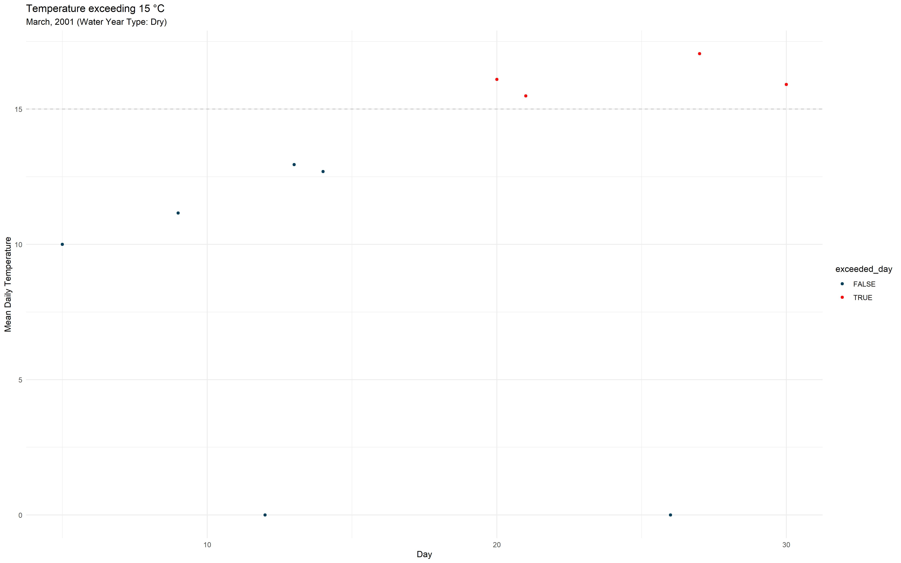
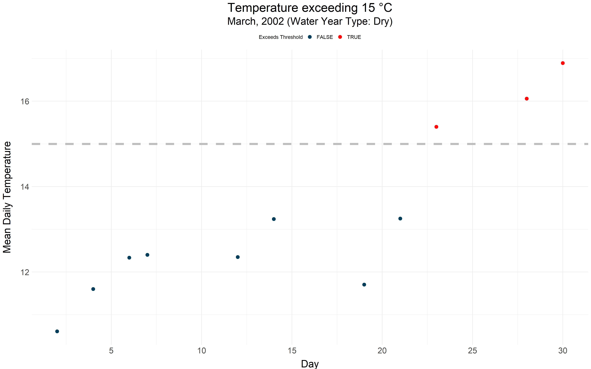
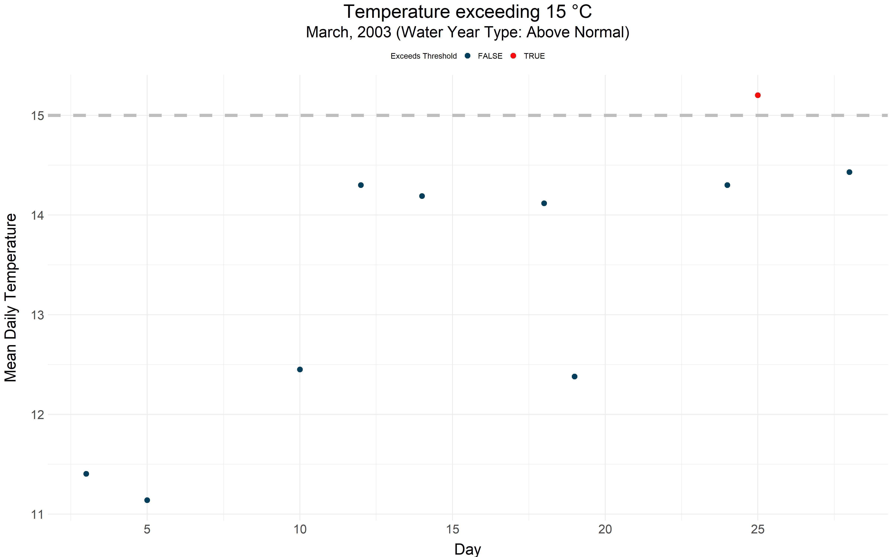
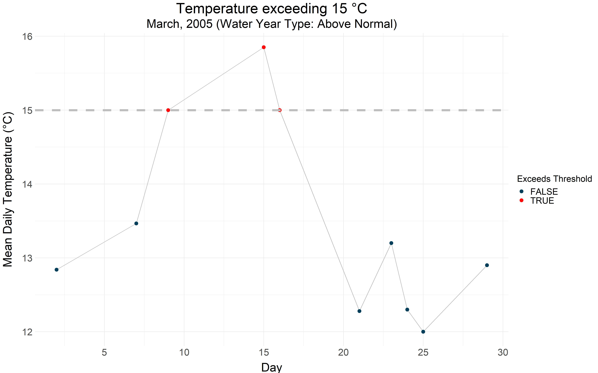
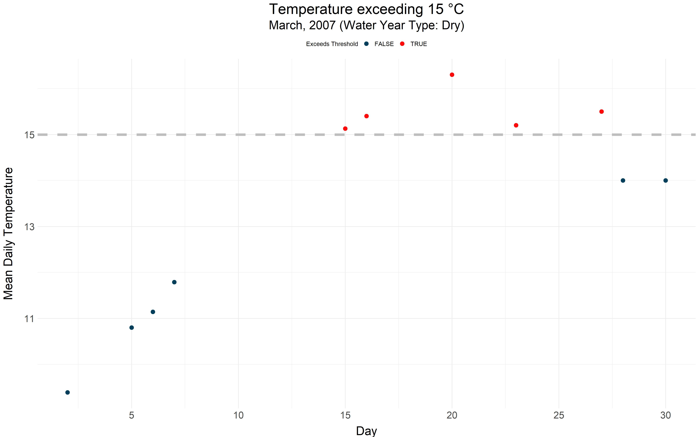
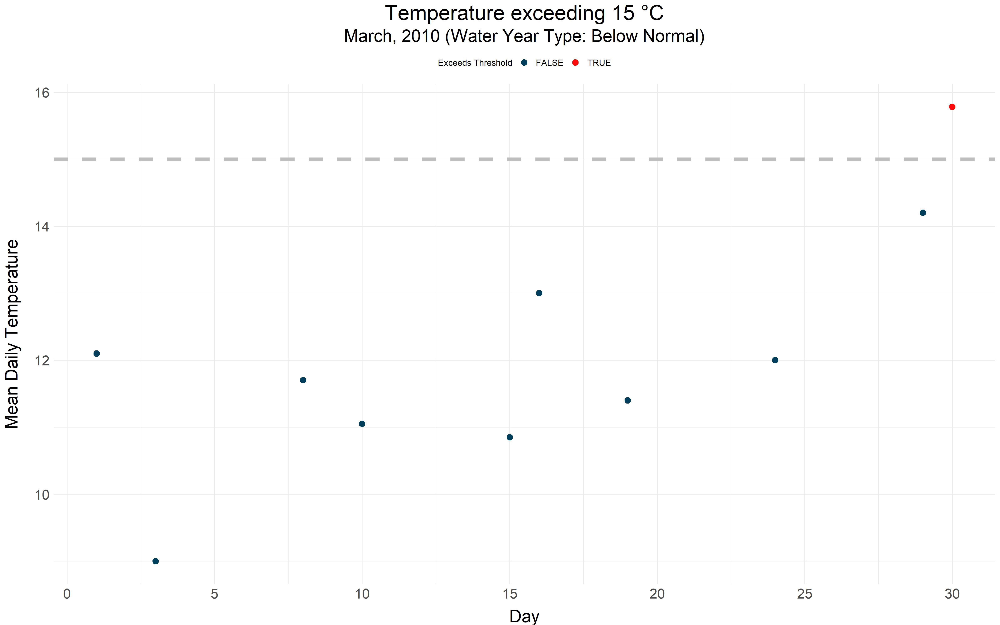

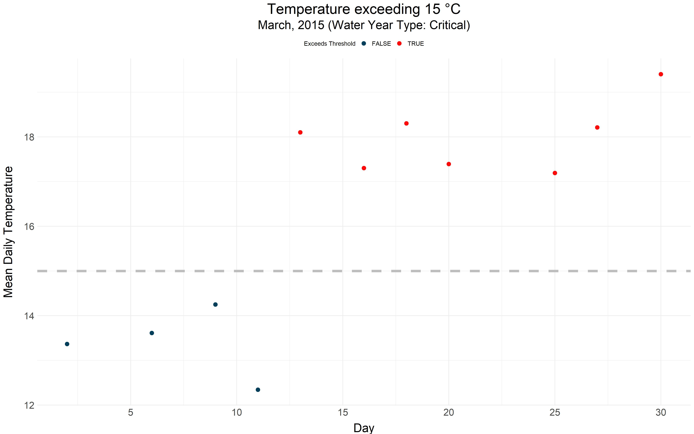
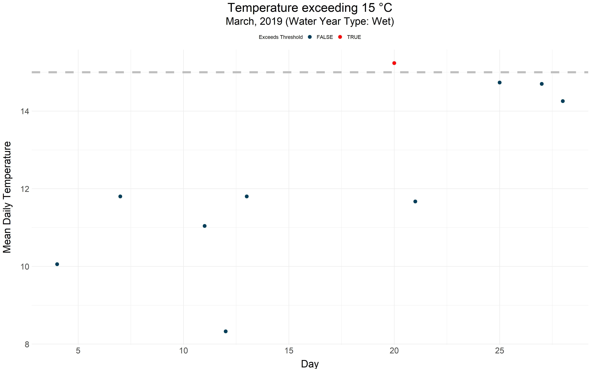

## April Temp Exceedance

**April Proportion Temp Exceedance of Threshold by Water Year Type**

```{r, echo=FALSE, message=FALSE,warning=FALSE}
april_prop_by_type <- temps_exceeding %>% 
  filter(month == 4) %>% 
  group_by(water_year_type) %>% 
  summarise(`Mean Prop Above Threshold` = mean(prop_above_threshold)) %>% 
  ungroup %>%
  left_join(order) %>% 
  arrange(Number) %>%
  select(`Water Year Type` = water_year_type, `Mean Prop Above Threshold`)  %>% na.omit    

knitr::kable(april_prop_by_type)
```

### Figures 


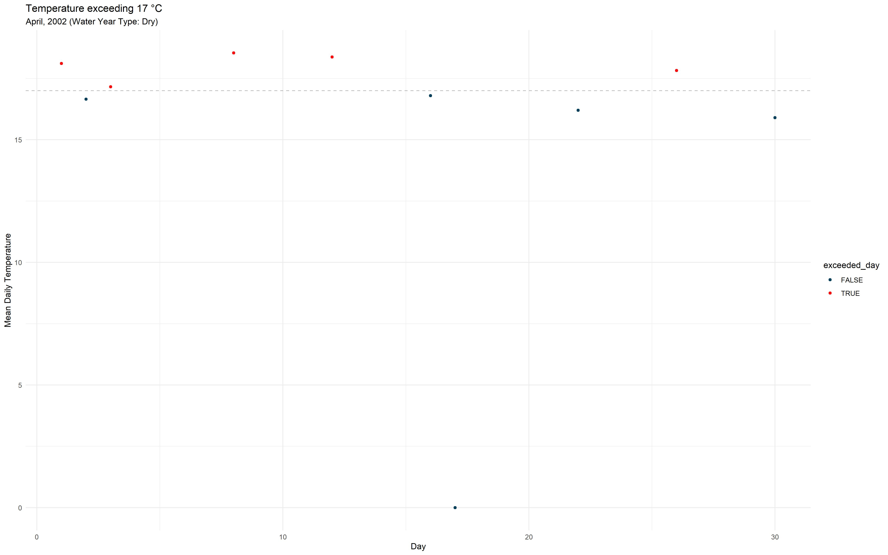

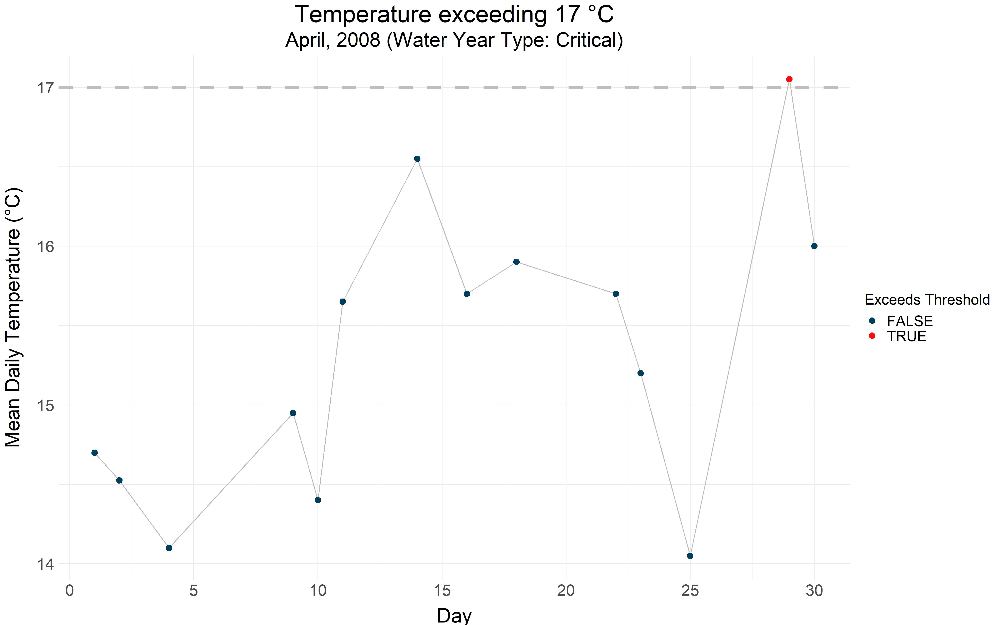
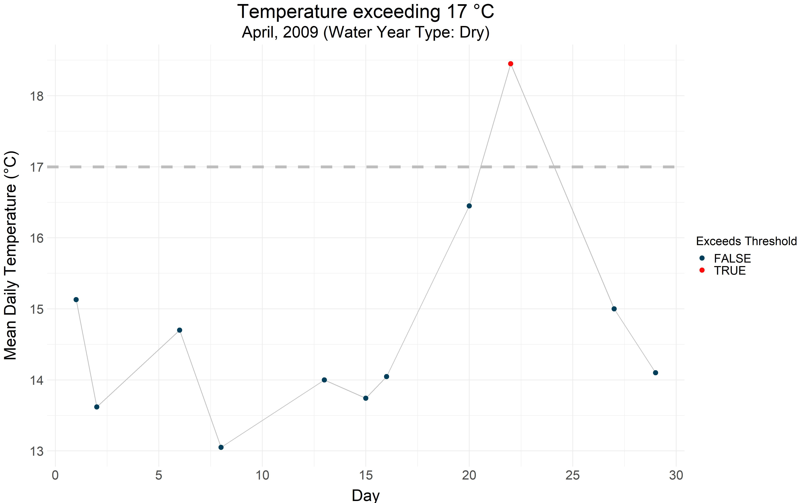
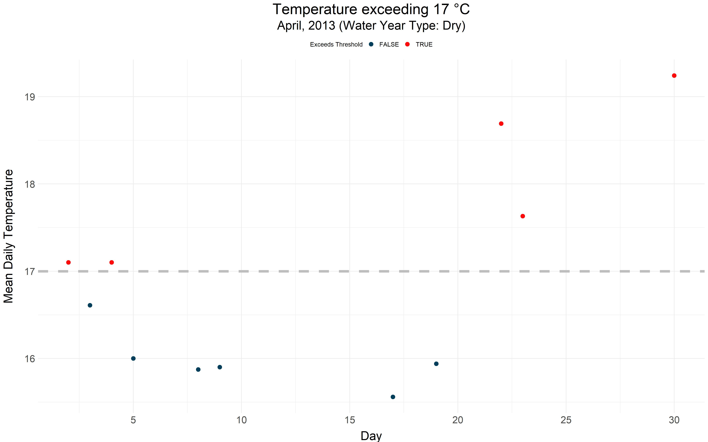
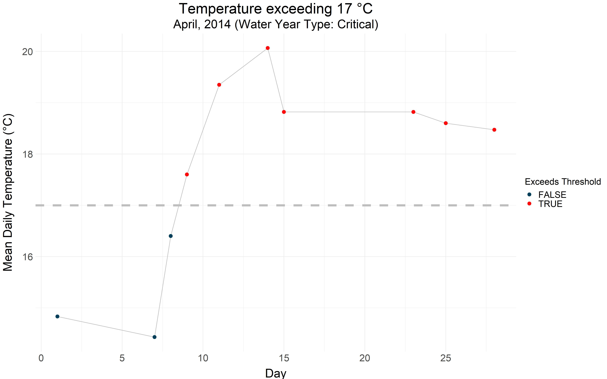


